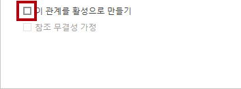
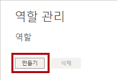
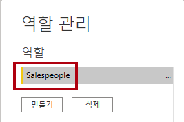
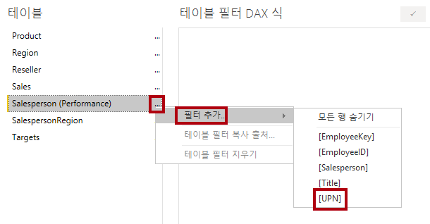
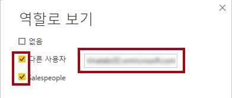



### 랩 05A

Power BI Desktop의 고급 데이터 모델링

# 개요

**랩을 완료하는 데 예상되는 시간은 45분입니다.**

이 랩에서는 **영업 사원** 테이블과 **판매** 테이블 간에 다-대-다 관계를 만듭니다. 또한 영업 사원이 할당된 지역의 판매 데이터만 분석할 수 있도록 행 수준 보안을 적용합니다.

이 랩의 학습 내용은 다음과 같습니다.

* 다 대 다 관계 구성하기

* 행 수준 보안 적용하기

# 연습 1: 다 대 다 관계 만들기

이 연습에서는 **영업 직원** 테이블과 **영업** 테이블 간에 다대다 관계를 만듭니다.

이전 랩을 성공적으로 마쳤다는 확신이 없으면 **D:\DA100\Lab04A\Solution** 폴더에 있는 이전 랩의 솔루션 파일을 열 수 있습니다.

### 작업 1: 다 대 다 관계 만들기

이 작업에서는 **영업 사원** 테이블과 **판매** 테이블 간에 다-대-다 관계를 만듭니다.

1. Power BI Desktop에서 보고서 보기의 **필드** 창에서 다음 두 필드를 선택하여 테이블 시각적 개체를 만듭니다.

	* Salesperson | Salesperson

	* 영업 | 영업

	

	*이 테이블에는 각 영업 사원의 판매 내역이 표시됩니다. 그러나 영업 사원과 판매 간에는 또 다른 관계가 있습니다. 일부 영업 사원은 하나, 둘 또는 더 많은 판매 지역에 속합니다. 또한 판매 지역에는 여러 판매원이 할당될 수 있습니다*.

	*실적 관리 측면에서 영업 직원의 판매량(할당된 지역을 기준으로 함)을 분석하고 판매 목표와 비교해야 합니다. 이 연습에서는 이 분석을 지원하기 위해 관계를 만듭니다*.

2. Michael Blythe의 판매 금액이 약 9백만 달러인 것을 확인합니다.

3. 모델 뷰로 전환합니다.

4. 끌어서 놓기 기술을 사용하여 다음의 두 모델 관계를 만듭니다.

	* **Salesperson | EmployeeKey** 대 **SalespersonRegion | EmployeeKey**

	* **Region | SalesTerritoryKey**에서 **SalespersonRegion | SalesTerritoryKey**

	***SalespersonRegion** 테이블을 브리징 테이블로 간주할 수 있습니다*.

5. 보고서 뷰로 전환하면 시각적 개체가 업데이트되지 않은 것을 볼 수 있습니다. 즉, Michael Blythe의 판매량이 변경되지 않았습니다.

6. 모델 뷰로 다시 전환한 다음 **영업 사원** 테이블에서 관계 필터 방향(화살표)을 따릅니다.

	***Salesperson** 테이블이 **Sales** 테이블을 필터링한다는 것을 고려합니다. 또한 **SalespersonRegion** 테이블도 필터링하지만 계속해서 **Region** 테이블에 전파하지는 않습니다(화살촉이 잘못된 방향을 가리킴)*.

	

7. **지역**과 **SalespersonRegion** 테이블 간의 관계를 편집하려면 해당 관계를 두 번 클릭합니다.

8. **관계 편집** 창의 **교차 필터 방향** 드롭다운 목록에서 **모두**를 선택합니다.

9. **보안 필터를 양방향으로 적용** 확인란을 선택합니다.

	*이 설정은 행 수준 보안이 적용될 때 양방향 필터링이 적용되도록 합니다. 다음 연습에서 보안 역할을 구성합니다*.

	

10. **확인**을 클릭합니다.

	

11. 관계에 이중 화살표가 있습니다.

	

12. 보고서 뷰로 전환한 다음 판매 값이 변경되지 않은 것을 확인합니다.

	*이제 이 문제는 **영업 사원**과 **판매** 테이블 사이에 두 개의 가능한 필터 전파 경로가 있다는 사실과 관련이 있습니다. 이러한 모호성은 내부적으로 “최소 테이블 수” 평가를 기반으로 해결됩니다. 명확히 하자면, 이 유형의 모호성이 있는 모델을 디자인해서는 안 됩니다. 이 랩에서 부분적으로 다루고 다음 랩에서도 다루겠습니다*.

13. 모델 뷰로 전환합니다.

14. 브리징 테이블을 통해 필터 전파를 강제로 적용하려면 **영업 사원**과 **판매** 테이블 간의 관계를 두 번 클릭합니다.

15. **관계 편집** 창에서 **이 관계를 활성으로 만들기** 확인란을 선택 취소합니다.

	

16. **확인**을 클릭합니다.

	

	*이제 필터 전파는 활성 경로만 사용하게 됩니다*.

17. 다이어그램에서 비활성 관계가 파선으로 표시됩니다.

	

18. 보고서 뷰로 전환하면 Michael Blythe의 판매량이 거의 2,200만 달러인 것을 볼 수 있습니다.

	

19. 또한 각 영업 사원의 판매액(추가 된 경우)이 총액을 초과합니다.

	*이 관찰은 지역 판매 결과를 이중, 삼중 등으로 계산하기 때문에 다대다 관계입니다. 목록에 두 번째로 나온 판매원인 Brian Welcker를 보십시오. 그의 판매 금액은 총 판매 금액과 동일합니다. Brian Welcker는 판매 담당 이사이기 때문에 맞는 결과입니다. 그의 판매량은 모든 지역의 판매량으로 측정되기 때문입니다*.

	*다 대 다 관계가 작동하는 동안에는 이제 영업 사원이 달성한 판매량을 분석할 수 없습니다(관계가 비활성 상태임). 다음 랩에서는 (해당 지역의) 성능 분석을 위해 판매원을 나타내는 계산된 테이블을 소개합니다*.

20. 모델링 뷰로 전환한 다음 다이어그램에서 **영업 사원** 테이블을 선택합니다.

21. **속성** 창의 **이름** 상자에서 텍스트를 **Salesperson (Performance)**으로 바꿉니다.

	*이름이 바뀐 이 테이블은 이제 테이블의 목적을 반영합니다. 이 테이블은 할당된 판매 지역의 판매량을 기반으로 판매원의 성과를 보고하고 분석하는 데 사용됩니다*.

### 작업 2: 목표 테이블 관련

이 작업에서는 **대상** 테이블에 대한 관계를 만듭니다.

1. **Salesperson (Performance)**에서 관계를 만듭니다.** | 직원 ID** 열 및 **목표 | EmployeeID** 열에서 관계를 만듭니다.

23. 보고서 뷰에서 **여러 목표 | 대상** 필드를 테이블 시각적 개체에 추가합니다.

	테이블 시각적 개체를 확장하여 모든 데이터를 표시합니다. 

	

24. 이제 판매와 목표를 시각화할 수 있지만 두 가지 이유로 주의해야 합니다. 첫째, 기간에 필터가 없으므로 향후 목표 값도 포함됩니다. 둘째, 대상이 추가되지 않으므로 합계를 표시해서는 안 됩니다. 시각적 서식 속성을 사용하여 비활성화하거나 계산 논리를 사용하여 제거할 수 있습니다. **Lab 06B**에서는 두 명 이상의 영업 사원이 필터링되면 BLANK를 반환하는 대상 측정을 작성합니다.

# 연습 2: 행 수준 보안 적용하기

이 연습에서는 영업 직원이 할당된 지역에 대한 판매량만 볼 수 있도록 행 수준 보안을 적용합니다.

### 작업 1: 행 수준 보안 적용하기

이 작업에서는 판매원이 할당된 지역에 대한 판매량만 볼 수 있도록 행 수준 보안을 적용합니다.

1. 데이터 보기로 전환합니다.

	

26. **필드** 창에서 **Salesperson (Performance)** 테이블을 선택합니다.

27. 데이터를 검토하여 Michael Blythe(EmployeeKey 281)에 Power BI 계정(**UPN**열)이 할당되었음을 확인합니다.

	*Michael Blythe는 판매 지역 세 곳에 할당되어 있습니다: 미국 북동부, 미국 중부, 미국 남동부*.

28. 보고서 보기로 전환합니다.

29. **보안** 그룹 내부의 **모델링** 리본 탭에서 **역할 관리**를 클릭합니다.

	

30. **역할 관리** 창에서 **만들기**를 클릭합니다.

	

31. 상자에서 선택한 텍스트를 역할 이름으로 바꿉니다. **Salespeople**, 그 다음 **입력**을 누릅니다.

	

32. 필터를 할당하려면 **Salesperson (Performance)** 테이블에서 줄임표(...) 문자를 클릭한 다음 **필터 추가**를 선택합니다.** | [UPN]**.

	

33. **Table Filter DAX Expression** 상자에서 **"값"**을 **USERNAME()**으로 바꿔 식을 수정합니다.

	

	*USERNAME()은 인증된 사용자를 검색하는 DAX(Data Analysis Expressions) 함수입니다. 즉, **Salesperson (Performance)** 테이블은 모델을 쿼리하는 사용자의 UPN(User Principal Name)으로 필터링합니다*.

34. **저장**을 클릭합니다.

	

35. 보안 역할을 테스트하려면 **보안** 그룹 내부의 **모델링** 리본 탭에서 **View As**를 클릭합니다.

	

36. **역할로 보기** 창에서 **다른 사용자** 항목을 선택한 다음 해당 상자에 계정 이름을 입력합니다.

	*팁:  **MySettings.txt** 파일*에서 복사할 수 있습니다.

37. **Salespeople** 역할을 확인합니다.

	

	*이 구성으로 **Salespeople** 역할을 사용하고 계정 이름으로 사용자를 가장합니다*.

38. **확인**을 클릭합니다.

	

39. 테스트 보안 컨텍스트를 설명하는 보고서 페이지 위의 노란색 배너를 확인합니다.

	

40. 테이블 시각적 개체에서 판매원 **Michael Blythe**만 나열되는 것을 확인합니다.

	

41. 테스트를 중지하려면 노란색 배너 오른쪽에서 **보기 중지**를 클릭합니다.

	

	* Power BI Desktop 파일이 Power BI 서비스에 게시되면 보안 주체를 **Salespeople** 역할에 매핑하는 게시 후 작업이 있습니다. **Lab 06B**에서 이 작업을 수행합니다*.

### 완료

이 작업에서는 랩을 완료합니다.

1. Power BI Desktop 파일을 저장합니다.

43. Power BI Desktop을 열어 둡니다.

	*다음 랩에서는 DAX를 사용한 계산을 통해 데이터 모델을 향상시킵니다*.
