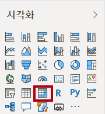
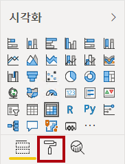
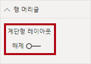
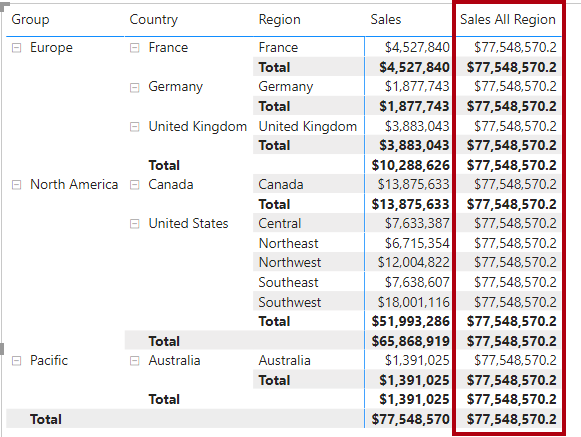
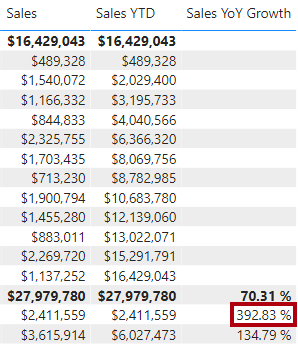
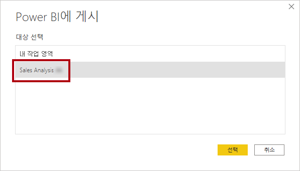
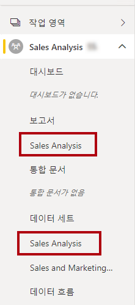
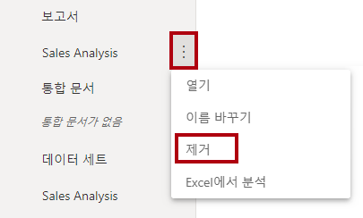



### 랩 06B

Power BI Desktop에서 DAX 사용, 파트 2

# 개요

**랩을 완료하는 데 예상되는 시간은 45분입니다.**

이 랩에서는 필터 컨텍스트를 조작하는 DAX 식을 사용하여 측정값을 만듭니다.

이 랩의 학습 내용은 다음과 같습니다.

* CALCULATE() 함수를 사용하여 필터 컨텍스트를 조작합니다

* 시간 인텔리전스 함수 사용

# 연습 1: 필터 컨텍스트 작업

이 연습에서는 필터 컨텍스트를 조작하는 DAX 식을 사용하여 측정값을 만듭니다.

이전 랩을 성공적으로 완료했다고 확신하지 못하면 **D:\DA100\Lab06A\Solution** 폴더에 있는 이전 랩의 솔루션 파일을 열 수 있습니다.

### 작업 1: 행렬 시각적 개체 만들기

이 작업에서는 새 측정값 테스트를 지원할 행렬 시작적 개체를 만듭니다.

1. Power BI Desktop의 보고서 뷰에서 새 보고서 페이지를 만듭니다.

	

2. **3페이지**에서 행렬 시각적 개체를 추가합니다.

	

3. 전체 페이지를 채우도록 행렬 시각적 개체의 크기를 조정합니다.

4. 행렬 시각적 개체 필드를 구성하려면 **필드** 창에서 **지역 | 지역** 계층 구조로 끌어와서 시각적 개체 내부에 놓습니다.

5. 또한 **매출 | 매출** 필드를 확인합니다.

6. 전체 계층 구조를 확장하려면 행렬 시각적 개체의 오른쪽 위에 있는 두 갈래로 갈라지는 화살표 아이콘을 두 번 클릭합니다.

	

	***지역** 계층 구조에 수준 **그룹**, **국가** 및 **지역***이 있음을 기억하세요.

7. 시각적 개체의 형식을 지정하기 위해 **시각화** 창 아래에 있는 **형식** 창을 선택합니다.

	

8. **검색** 상자에 **Stepped**를 입력합니다.

9.  **계단형 레이아웃** 속성을 **끄기**로 설정합니다.

	

10. 행렬 시각적 개체에 열 머리글 네 개가 있는지 확인합니다.

	

	*Adventure Works에서 영업 지역은 그룹, 국가 및 지역으로 구성됩니다. 미국을 제외한 모든 국가에는 하나의 지역만 있으며, 이러한 지역의 이름은 국가의 이름을 따서 명명됩니다. 미국은 이렇게 큰 판매 영역이기 때문에 5개 지역으로 나뉩니다*.

	*이 연습에서 여러 측정값을 만든 다음 행렬 시각적 개체에 추가하여 테스트합니다*.

### 작업 2: 필터 컨텍스트 조작

이 작업에서는 CALCULATE() 함수를 사용하여 필터 컨텍스트를 조작하는 DAX 식으로 여러 측정값을 만듭니다.

1. 다음 식에 따라 **Sales** 테이블에 측정값을 추가합니다.

	*편의를 위해 이 랩의 모든 DAX 정의를 **D:\DA100\Lab06B\Assets\Snippets.txt** 파일에서 복사할 수 있습니다*.


	**DAX**

	```
	Sales All Region =
	CALCULATE(SUM(Sales[Sales]), REMOVEFILTERS(Region))
	```

	*CALCULATE() 함수는 필터 컨텍스트를 조작하는 데 사용되는 강력한 함수입니다. 첫 번째 인수는 식 또는 측정값을 사용합니다(측정값은 명명된 식일 뿐입니다.). 후속 인수를 사용하면 필터 컨텍스트를 수정할 수 있습니다*.

	*REMOVEFILTERS() 함수는 활성 필터를 제거합니다. 인수나 테이블, 또는 하나 이상의 열을 인수로 사용할 수 없습니다*.

	*이 수식에서 측정값은 수정된 필터 컨텍스트에서 **Sales** 열의 합을 평가하여 **Region** 테이블에 적용되는 필터를 제거합니다*.

2. **Sales All Region** 측정값을 행렬 시각적 개체에 추가합니다. 

	

3. **Sales All Region** 측정값은 각 지역, 국가(소계) 및 그룹(소계)에 대한 전 지역 매출의 합계를 계산합니다.

	*이 측정값은 아직 유용한 결과를 제공하지 않습니다. 그룹, 국가 또는 지역의 매출을 이 값으로 나눌 때 "총계의 백분율"이라고 하는 유용한 비율을 생성합니다*.

4. **필드** 창에서 **Sales All Region** 측정값이 선택되었는지 확인하고 수식 표시줄에서 측정값 이름과 수식을 다음 수식으로 바꿉니다.

	*팁: 기존 수식을 바꾸려면 먼저 코드 조각을 복사합니다. 그런 다음 수식 입력줄 내부를 클릭하고 **Ctrl+A**를 눌러서 모든 텍스트를 선택합니다. 그런 다음 **Ctrl+V**를 눌러 코드 조각을 붙여 넣어서 선택한 텍스트를 덮어씁니다. **Enter** 키를 누릅니다*.


	**DAX**

	```
	Sales % All Region =
	DIVIDE(
       SUM(Sales[Sales]),
       CALCULATE(
            SUM(Sales[Sales]),
            REMOVEFILTERS(Region)
       )
	)
	```   
	*이 측정값은 업데이트된 수식을 정확히 반영하도록 이름이 변경되었습니다. **DIVIDE()** 함수는 **Region** 테이블에 적용된 필터를 제거하는 수정된 컨텍스트에서 **영업** 측정값으로 **영업** 측정값(필터 컨텍스트에 의해 수정되지 않음)을 분할합니다*.

5. 행렬 시각적 개체에서 측정값의 이름이 변경되었으며 각 그룹, 국가 및 지역에 대해 다른 값이 표시됩니다.

6. **Sales % All Region** 측정값의 형식을 소수점 두 자리의 백분율로 지정합니다.

7. 행렬 시각적 개체에서 **Sales % All Region** 측정값을 검토합니다.

	

8. 다음 식을 기반으로 **Sales** 테이블에 다른 측정값을 추가하고 백분율로 형식을 지정합니다.


	**DAX**

	```
	Sales % Country =
	DIVIDE(
       SUM(Sales[Sales]),
       CALCULATE(
           SUM(Sales[Sales]),
           REMOVEFILTERS(Region[Region])
       )
	)
	```

9.  **Sales % Country** 측정값 수식은 **Sales % All Region** 측정값 수식과는 조금 다릅니다.

	*차이점은 분모가 **Region** 테이블의 모든 열이 아닌 **Region** 테이블의 **Region** 열에 대해 필터를 제거하여 필터 컨텍스트를 수정한다는 것입니다. 즉, 그룹 또는 국가 열에 적용되는 모든 필터가 유지됩니다. 국가의 백분율로 매출을 나타내는 결과를 얻습니다*.

10. **Sales % Country** 측정값을 행렬 시각적 개체에 추가합니다.

11. 미국의 지역만 100%가 아닌 값이 생성됩니다.

	

	*미국에만 여러 지역이 있다는 점을 기억하세요. 다른 모든 국가에는 모두 100%인 이유를 설명하는 단일 지역이 있습니다*.

12. 시각적으로 이 측정값의 가독성을 향상하려면 **Sales % Country** 측정값을 이 향상된 수식으로 덮어씁니다.


	**DAX**

	```
	Sales % Country =
	IF(
        ISINSCOPE(Region[Region]),
    	DIVIDE(
        	SUM(Sales[Sales]),
        	CALCULATE(
                SUM(Sales[Sales]),
                REMOVEFILTERS(Region[Region)
            )
        ) 
	)
	```

	*IF() 함수 안에 포함된 ISINSCOPE() 함수는 영역 열이 수준 계층 구조의 수준인지 여부를 테스트하는 데 사용됩니다. true이면 DIVIDE() 함수가 평가됩니다. false 부분이 없기 때문에 지역 열이 범위에 있지 않을 때 공백이 반환됩니다*.

13. 이제 **Sales % Country** 측정값은 지역이 범위 안에 있을 때만 값을 반환합니다.

	

14. 다음 식을 기반으로 **Sales** 테이블에 다른 측정값을 추가하고 백분율로 형식을 지정합니다.


	**DAX**

	```
	Sales % Group =
	DIVIDE(
        SUM(Sales[Sales]),
        CALCULATE(
             SUM(Sales[Sales]),
             REMOVEFILTERS(
                 Region[Region],
                 Region[Country]
             )
        )
	)
	```

	*그룹의 백분율로 매출을 달성하기 위해 두 개의 필터를 적용하여 두 열의 필터를 효과적으로 제거할 수 있습니다*.

15. **Sales % Group** 측정값을 행렬 시각적 개체에 추가합니다.

16. 시각적으로 이 측정값의 가독성을 향상하려면 **Sales % Group** 측정값을 이 개선된 수식으로 덮어씁니다.


	**DAX**

	```
	Sales % Group =
	IF(
        ISINSCOPE(Region[Region])
             || ISINSCOPE(Region[Country]),
        DIVIDE(
            SUM(Sales[Sales]),
            CALCULATE(
                SUM(Sales[Sales]),
                REMOVEFILTERS(
                     Region[Region],
                     Region[Country]
                )
            )
        )
	)
	```

17. **Sales % Group** 측정값은 이제 지역 또는 국가가 범위 안에 들 때만 값을 반환합니다.

18. 모델 보기에서 세 가지 새 측정값을 **Ratios**라는 표시 폴더에 넣습니다.

	

19. Power BI Desktop 파일을 저장합니다.

	***Sales** 테이블에 추가된 측정값은 계층적 탐색을 달성하기 위해 필터 컨텍스트를 수정했습니다. 소계 계산을 위해서는 필터 컨텍스트에서 일부 열을 제거하고 총합계에 도달하려면 모든 열을 제거해야 합니다*.

# 연습 2: 시간 인텔리전스 작업

이 연습에서는 매출 YTD(연간 누계) 측정값과 매출 YoY(전년대비) 성장률 측정값을 만듭니다.

### 작업 1: YTD 측정값 만들기

이 작업에서는 매출 YTD 측정값을 만듭니다.

1. 보고서 보기의 **2페이지**에서 행렬 시각적 개체에는 행에 연수와 개월이 그룹화된 다양한 측정값이 표시됩니다.

2. 다음 식에 따라 **Sales** 테이블에 측정값을 추가하고 소수점 첫째자리로 형식을 지정합니다.


	**DAX**

	```
	Sales YTD =  
	TOTALYTD(SUM(Sales[Sales]), 'Date'[Date], "6-30")
	```

	*TOTALYTD() 함수는 식을 평가하며, 이 경우에는 지정된 날짜 열에 대한 **Sales** 열의 합계입니다. 날짜 열은 **랩 06A**에서와 마찬가지로 날짜 테이블로 표시된 날짜 테이블에 속해야 합니다. 이 함수는 1년의 마지막 날짜를 나타내는 세 번째 선택적 인수를 사용할 수도 있습니다. 이 날짜가 없다는 것은 12월 31일이 연중 마지막 날짜임을 의미합니다. Adventure Works의 경우, 해당 연도의 마지막 달인 6월에 사용되므로 "6-30"이 사용됩니다*.

3. **Sales** 필드와 **Sales YTD** 측정값을 행렬 시각적 개체에 추가합니다.

4. 해당 연도의 누적 매출 값을 확인합니다.

	

	*TOTALYTD() 함수는 필터 조작, 특히 시간 필터 조작을 수행합니다. 예를 들어, 2017년 9월(회계 연도의 세 번째 달)에 대한 YTD 매출을 계산하려면 **Date** 테이블의 모든 필터가 제거되고 연초에 시작하는 새 날짜 필터(2017년 7월 1일)로 대체되며 컨텍스트 내 날짜 기간의 마지막 날짜(2017년 9월 30일)까지 연장됩니다.*

	*일반적인 시간 필터 조작을 지원하기 위해 DAX에서 많은 시간 인텔리전스 기능을 사용할 수 있습니다.*

### 작업 2: YoY 성장률 측정값 만들기

이 작업에서는 매출 YoY 성장률 측정값을 만듭니다.

1. 다음 식에 따라 **Sales** 테이블에 다른 측정값을 추가합니다. 


	**DAX**

	```
	Sales YoY Growth =
	VAR SalesPriorYear =
    	CALCULATE(
        	SUM(Sales[Sales]),
        	PARALLELPERIOD(
            	'Date'[Date],
            	-12,
           	 MONTH
       	    )
        )
	RETURN
        SalesPriorYear
	```
	* **Sales YoY Growth** 측정값 수식에는 변수가 선언됩니다. 변수는 수식 논리를 간소화하는 데 유용할 수 있으며 식을 수식 내에서 여러 번 평가해야 하는 경우(YoY 성장 논리의 경우) 더 효율적입니다. 변수는 고유한 이름으로 선언되며 측정값 식은 **RETURN** 키워드 다음에 출력되어야 합니다*.

	* **SalesPriorYear** 변수에는 PARALLELPERIOD() 함수를 사용하여 필터 컨텍스트의 각 날짜에서 12개월 뒤로 이동하는 수정된 컨텍스트에서 **판매** 열의 합을 계산하는 식이 할당됩니다.*

2. **Sales YoY Growth** 측정값을 행렬 시각적 개체에 추가합니다.

3. 새 측정값은 처음 12개월 동안은 공백을 반환합니다(2017 회계연도 이전에 기록된 매출이 없기 때문입니다).

4. **2017년 7월**에 대한 **Sales YoY Growth** 측정값은 **2016년 1월**에 대한 **Sales** 값입니다.

	

	*이제 수식의 "어려운 부분"을 테스트했으므로 성장 결과를 계산하는 최종 수식으로 측정값을 덮어쓸 수 있습니다.*

5. 측정값을 완료하려면 형식을 소수점 두 자리 백분율로 지정하여 **Sales YoY Growth** 측정값을 이 수식으로 덮어씁니다.


	**DAX**

	```
	Sales YoY Growth =
	VAR SalesPriorYear =
    	CALCULATE(
        	  SUM(Sales[Sales]),
        	  PARALLELPERIOD(
              'Date'[Date],
              -12,
              MONTH
            )
	)
	RETURN
       DIVIDE(
           (SUM(Sales[Sales]) - SalesPriorYear),
           SalesPriorYear
       )
	```

6. 수식의 **RETURN** 절에서는 변수가 두 번 참조됩니다.

7. **2018년 7월**의 YoY 성장률이 **392.83%** 인지 확인합니다.

	

	*즉, 2018년 7월 매출($2,411,559)은 전년도($489,328)에 비해 거의 400%(거의 4배) 개선된 것으로 나타났습니다.*

8. 모델 뷰에서 두 가지 새 측정값을 **Time Intelligence**라는 이름의 표시 폴더에 넣습니다.

	

9. Power BI Desktop 파일을 저장합니다.

	*DAX에는 일반적인 비즈니스 시나리오에 대한 시간 필터 조작을 쉽게 구현할 수 있도록 많은 시간 인텔리전스 기능이 포함되어 있습니다*.

	*이 연습에서는 데이터 모델 개발을 완료합니다. 다음 연습에서는 다음 랩에서 보고서를 작성할 준비가 된 Power BI Desktop 파일을 작업 영역에 게시합니다*.

# 연습 3: Power BI Desktop 파일 게시

이 연습에서는 Power BI Desktop 파일을 Power BI에 게시합니다.

### 작업 1: 파일 게시

이 작업에서는 Power BI Desktop 파일을 Power BI에 게시합니다.

1. Power BI Desktop 파일을 저장합니다.

	*이 랩을 성공적으로 완료했다고 확신하지 못하는 경우 **D:\DA100\Lab06B\Solution** 폴더에 발견된 Power BI Desktop 파일을 게시해야 합니다. 이 경우, 현재 Power BI Desktop 파일을 닫은 다음 솔루션 파일을 엽니다. 먼저 리본의 **새로 고침** 명령을 사용하여 데이터 새로 고침을 수행한 다음 이 작업의 지침을 계속 수행합니다.*

2. 파일을 게시하려면 **홈** 리본 탭의 **공유** 그룹 내부에서 **게시**를 클릭합니다.

	

3. **Power BI에 게시** 창에서 **판매 분석** 작업 영역을 선택합니다.

	*"내 작업 영역"이 아니라 **랩 01A**에서 만든 작업 영역에 게시해야 합니다*

	

4. **선택**을 클릭합니다.

	

5. 파일이 성공적으로 게시되었으면 **확인**을 클릭합니다.

	

6. Power BI Desktop을 닫습니다.

7. Edge의 Power BI 서비스 내 **탐색** 창(왼쪽에 위치)에서 **판매 분석** 작업 영역의 내용을 검토합니다.

	

	*게시물에 보고서 및 데이터 집합을 추가했습니다. 표시되지 않으면 **F5**를 눌러 브라우저를 다시 로드한 다음 작업 영역을 다시 확장합니다.*

	*데이터 모델이 게시되어 데이터 세트가 되었습니다. 모델 계산을 테스트하는 데 사용된 보고서가 보고서로 추가되었습니다. 이 보고서는 필요하지 않으므로 이제 삭제합니다.*

8. **판매 분석** 보고서를 커서로 가리키고 세로 줄임표(...)를 클릭한 다음 **제거**를 선택합니다.

	

9. 삭제할지 묻는 메시지가 표시되면, **삭제**를 클릭합니다.

	

	*다음 랩에서는 게시된 데이터 세트를 기반으로 보고서를 만듭니다*.

### 완료

이 작업에서는 랩을 완료합니다.

1. Microsoft Edge 브라우저 창을 열어 둡니다.
