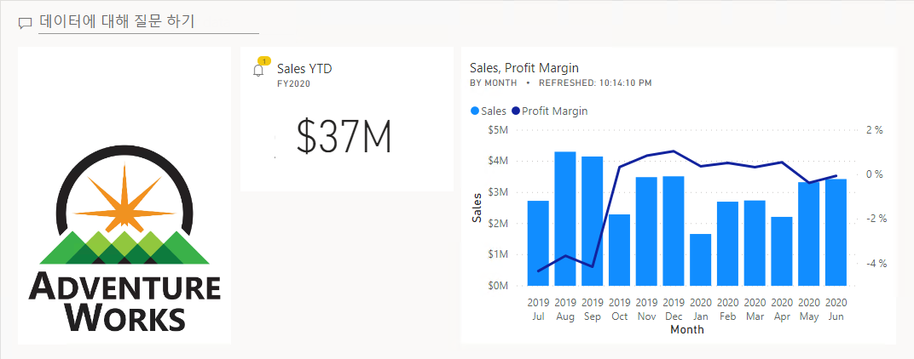
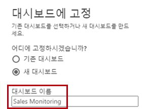
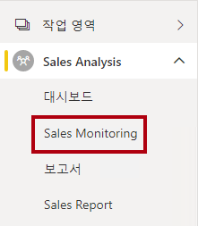
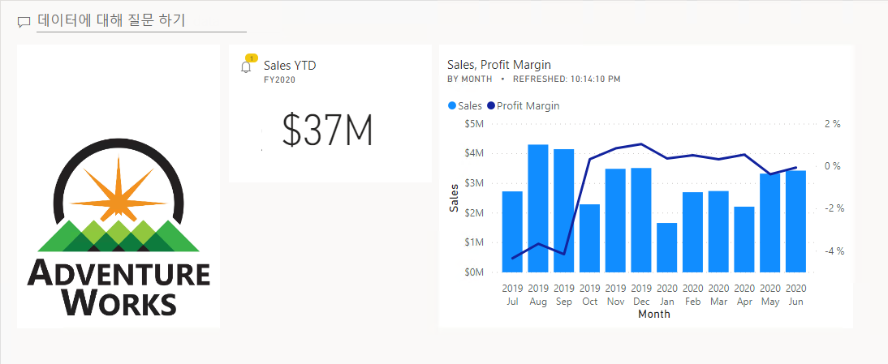
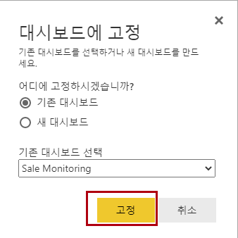
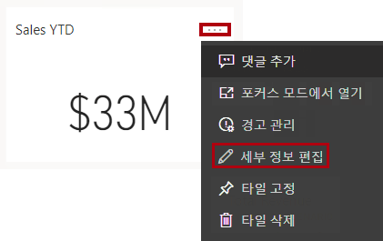
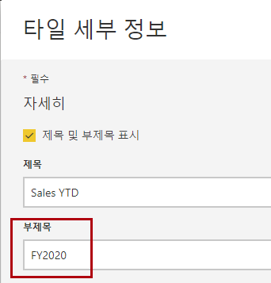
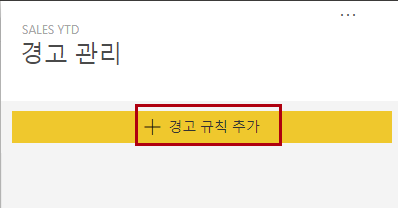
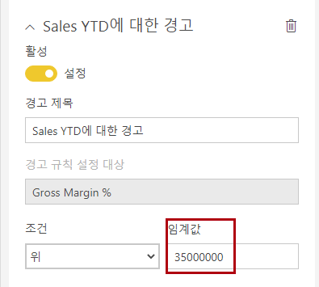



### 랩 10A

Power BI 대시보드 만들기

# 개요

**랩을 완료하는 데 예상되는 시간은 45분입니다**

이 랩에서는 **영업 모니터링** 대시보드를 만듭니다.

이 랩의 학습 내용은 다음과 같습니다.

* 대시보드에 시각적 개체 고정

* Q&A를 사용하여 대시보드 타일 생성

* 대시보드 타일 경고 구성하기

# 연습 1: 대시보드 만들기

이 연습에서는 **판매 모니터링** 대시보드를 만듭니다. 완성된 대시보드는 다음과 같아야 합니다.  

### 작업 1: 대시보드 만들기

이 작업에서는 **판매 모니터링** 대시보드를 만듭니다.

1. Edge에서 Power BI 서비스로 이동하여 **판매 보고서** 보고서를 엽니다.

2. 대시보드를 만들고 로고 이미지를 고정하려면 Adventure Works 로고 위에 커서를 올려 놓으세요.

3. 오른쪽 상단 모서리에서 압핀을 클릭합니다.

	

4. **대시보드에 고정** 창에서 **대시보드 이름** 상자에 **영업 모니터링**을 입력합니다.

	

5. **고정**을 클릭합니다.

	

6. **연도** 슬라이서를 **2020 회계연도**로 설정합니다.

	

7. **지역** 슬라이서를 **모두 선택**으로 설정합니다.

	*시각적 개체를 대시보드에 고정할 때 현재 필터 컨텍스트를 사용합니다. 일단 고정되면 필터 컨텍스트를 변경할 수 없습니다. 시간 기반 필터의 경우 상대 날짜 슬라이서(또는 상대 시간 기반의 질문을 사용하는 Q&A)를 사용하는 것이 좋습니다*.

8. **판매 모니터링** 대시보드에 **월별 판매 및 이익률** (열/줄) 시각적 개체를 고정합니다.

9. **탐색** 창을 열고 **판매 모니터링** 대시보드를 엽니다.

	

10. 대시보드에 두 개의 타일이 있습니다.

	

11. 로고 타일의 크기를 조정하려면 오른쪽 아래 모서리를 끌어서 타일 크기를 조정하여 너비는 1단위, 높이는 2단위로 조정합니다.

	*타일 크기는 직사각형 모양으로 제한됩니다. 직사각형 모양의 배수로만 크기를 조정할 수 있습니다*.

12. 대시보드 왼쪽 상단에 질문 기반의 타일을 추가하려면 **내 데이터에 대해 문의**를 클릭합니다.

	

13. Q&A 기능을 사용하여 질문할 수 있으며 Power BI는 시각적 개체에 응답합니다.

14. 회색 상자의 Q&A 상자 아래에 제안된 질문 중 하나를 클릭합니다.

15. 응답을 검토합니다.

16. Q&A 상자에서 모든 텍스트를 제거합니다.

17. Q&A 상자에 다음을 입력합니다. **Sales YTD**

	

18. **(공백)** 의 응답을 확인합니다.

	

	***랩 06B**에서 **Sales YTD** 측정값을 추가했던 것을 기억해 주세요. 이 측정값은 시간 인텔리전스 식이며 결과를 생성하려면 **날짜** 테이블의 필터가 필요합니다*.

19. **회계연도 2020**을 사용하여 질문을 확장합니다.

	

20. 이제 응답은 **3300만 달러**입니다.

	

21. 대시보드 오른쪽 상단 모서리에 응답을 고정하려면 **시각적 개체 고정**을 클릭합니다.

	

22. 타일을 대시보드에 고정하라는 메시지가 표시되면 **고정**을 클릭합니다. 

	

	*새 대시보드에만 고정할 수 있는 버그가 있을 수 있습니다. Power BI 세션이 "내 작업 영역"으로 되돌아갔기 때문입니다. 이 경우 새 대시보드에 고정하지 마세요. **판매 분석** 작업 공간으로 돌아가 대시보드를 다시 열고 Q&A 질문을 다시 만듭니다*.

23. 대시보드로 돌아가려면 왼쪽 상단 모서리에서 **Q&amp;A 종료**를 클릭합니다.

	

### 작업 2: 타일 세부 정보 편집

이 작업에서는 두 타일의 세부 정보를 편집합니다.

1. 커서를 **Sales YTD** 타일 위로 옮긴 다음 타일의 오른쪽 상단에 있는 줄임표를 클릭하고 **세부 정보 편집**을 선택합니다.

	

2. **타일 세부 정보** 창(오른쪽에 위치)에서 **부제** 상자에 **회계연도 2020**을 입력합니다.

	

3. 창 하단의 **적용**을 클릭하세요.

	

4. **Sales YTD** 타일에 부제가 표시됩니다.

	

5. **판매, 이익률** 타일에 대한 타일 세부 정보를 편집합니다.

6. **타일 세부 정보** 창의 **기능** 섹션에서 **마지막 새로 고침 시간 표시**를 확인합니다.

	

7. **적용**을 클릭합니다.

	

8. 타일은 마지막 새로 고침 시간(Power BI Desktop에서 데이터 모델을 새로 고친 시간)을 설명합니다.

이 랩의 뒷부분에서 데이터 새로 고침을 시뮬레이션하고 새로 고침 시간이 업데이트됩니다.

### 작업 3: 경고 구성

이 작업에서는 데이터 경고를 구성합니다.

1. **Sales YTD** 타일 위로 커서를 가져가고 줄임표을 클릭한 다음 **경고 관리**를 선택합니다.

	

2. **경고 관리** 창(오른쪽에 위치)에서 **경고 규칙 추가**를 클릭합니다.

	

3. **임계값** 상자에서 값을 **35000000**(3,500만)으로 바꿉니다.

	

	*이 구성은 타일이 3,500만 이상의 값으로 업데이트할 때마다 알림을 받을 수 있도록 합니다*.

4. 창 하단에서 **저장 및 닫기**를 클릭합니다.

	

	*다음 연습에서는 데이터 세트를 새로 고칩니다. 일반적으로 예약된 새로 고침을 사용하여 이 작업을 수행해야 하며 Power BI는 게이트웨이를 사용하여 SQL Server 데이터베이스에 연결할 수 있습니다. 그러나 교실 설정의 제약 사항으로 인해 게이트웨이가 없습니다. 따라서 Power BI Desktop을 열고 수동으로 데이터를 새로 고치고 파일을 업로드합니다*.

# 연습 2: 데이터 세트 새로 고침

이 연습에서는 먼저 2020년 6월의 판매 주문 데이터를 **AdventureWorksDW2020** 데이터베이스에 로드한 다음 교실 파트너의 계정을 데이터베이스에 추가합니다. 그런 다음 Power BI Desktop 파일을 열고 데이터를 새로 고친 다음 **판매 분석** 작업 영역에 파일을 업로드합니다.

### 작업 1: 랩 데이터베이스 업데이트

이 작업에서는 PowerShell 스크립트를 실행하여 **AdventureWorksDW2020** 데이터베이스의 데이터를 업데이트합니다.

1. 파일 탐색기에서 **D:\DA100\Setup** 폴더 내부의 **UpdateDatabase-2-AddSales.ps1** 파일을 마우스 오른쪽 단추로 클릭한 다음 **PowerShell에서 실행**을 선택합니다.

	

계속하려면 아무 키나 누르라는 메시지가 표시되면, **Enter** 키를 다시 누릅니다.

***AdventureWorksDW2020** 데이터베이스에는 2020년 6월 판매 주문이 포함되어 있습니다*.

2. **D:\DA100\Setup** 폴더 내부에서 마우스 오른쪽 버튼으로 **UpdateDatabase-3-AddPartnerAccount.ps1** 파일을 클릭한 다음 **PowerShell에서 실행**을 선택합니다.

3. 메시지가 표시되면 강의실 파트너의 계정 이름을 입력한 다음 **Enter** 키를 누릅니다.

	*계정 이름(@symbol 앞의 모든 문자)만 입력하면 됩니다. 근처에 앉아 있는 사람을 선택하세요. Power BI 콘텐츠 공유를 다루는 **Lab 12A**를 완료하기 위한 파트너로 함께 작업하게 됩니다*.

	*행 수준 보안을 테스트할 수 있도록 해당 계정 이름이 추가됩니다. 이제 파트너는 Pamela Ansam-Wolfe이며 파트너의 판매 실적은 두 개의 판매 지역의 판매량으로 측정됩니다. 미국 북서부와 미국 남서부*.

### 작업 2: Power BI Desktop 파일 새로 고침

이 작업에서는 판매 분석 Power BI Desktop 파일을 열고 데이터를 새로 고친 다음 파일을 **판매 분석** 작업 영역에 업로드합니다.

1. **D:\DA100\MySolution** 폴더에 저장된 **판매 분석** Power BI Desktop 파일을 엽니다.

	*파일이 **랩 06B**에 게시되었을 때 랩을 성공적으로 완료했다는 확신이 들지 않으면 솔루션 파일을 대신 업로드하는 것이 좋습니다. 솔루션 파일을 업로드한 경우 이제 솔루션 파일을 다시 열어야 합니다. **D:\DA100\Lab06B\Solution** 폴더에 있습니다*.

2. **쿼리** 그룹 내부의 **홈** 리본에서 **새로 고침**을 클릭합니다.

	

3. 새로 고침이 완료되면 Power BI Desktop 파일을 저장합니다.

4. 파일을 **판매 분석** 작업 영역에 게시합니다.

5. 데이터 세트를 바꾸라는 메시지가 표시되면 **바꾸기**를 클릭합니다.

	

	*이제 Power BI 서비스의 데이터 세트에는 2020년 6월 판매 데이터가 있습니다*.

6. Power BI Desktop을 닫습니다.

7. Edge에서 **판매 분석** 작업 영역의 Power BI 서비스에 **판매 분석** 보고서도 게시된 것을 확인합니다.

	이 보고서는 **랩 05A** 및 **랩 06A**에서 개발한 모델을 테스트하는 데 사용되었습니다.

8. 데이터 세트가 아닌 **판매 분석** 보고서를 제거합니다.

# 연습 3: 대시보드 검토

이 연습에서는 대시보드를 검토하여 업데이트된 판매량을 알리고 경고가 트리거되었습니다.

### 작업 1: 대시보드 검토

이 작업에서는 대시보드를 검토하여 업데이트된 판매와 트리거된 경고를 확인합니다.

1. Edge의 Power BI 서비스에서 **판매 모니터링** 대시보드를 엽니다.

2. **이제** **판매, 이익 마진** 타일의 자막에서 데이터가 새로 고쳐졌습니다.

3. 또한 **2020년 6월**에 대한 열이 있음을 알 수 있습니다.

	

	***Sales YTD** 타일에 대한 경고도 트리거되어야 합니다. 잠시 후 경고는 판매가 구성된 임계값을 초과한다는 것을 알려 줍니다*.

4. **Sales YTD** 타일이 **$37M**으로 업데이트되었음을 알 수 있습니다.

5. **Sales YTD** 타일에 경고 알림 아이콘이 표시되는지 확인합니다.

	*알림이 표시되지 않으면 **F5** 키를 눌러 브라우저를 다시 로드해야 할 수 있습니다. 알림이 아직 표시되지 않으면 몇 분 더 기다립니다*.

	

	*경고 알림은 대시보드 타일에 표시되며 이메일로 전달하거나 Apple Watch8를 포함한 모바일 앱으로 알림을 푸시할 수도 있습니다*.
