

### 랩 11A

Power BI Desktop의 데이터 분석

# 개요

**랩을 완료하는 데 예상되는 시간은 45분입니다.**

이 랩에서는 **판매 탐색** 보고서를 만듭니다.

이 랩의 학습 내용은 다음과 같습니다.

* 애니메이션 분산 차트 만들기

* 시각적 개체를 사용하여 값 예측

* 분해 트리 시각적 개체를 사용하여 작업하기

* 주요 영향 요소 시각적 개체를 사용하여 작업

# 연습 1: 보고서 만들기

이 연습에서는 **판매 탐색** 보고서를 만듭니다.

### 작업 1: 보고서 만들기

이 작업에서는 **판매 탐색** 보고서를 만듭니다.

1. Power BI Desktop을 열고 시작 화면을 해제합니다.

	

2. **D:\DA100\MySolution** 폴더에 파일을 **판매 탐색**으로 저장합니다.

	

3. **판매 분석** 데이터 집합에 대한 라이브 연결을 만듭니다.

	*팁: **홈** 리본 탭에서 **데이터 가져오기** 명령을 사용한 다음 **Power BI 데이터 세트***를 선택합니다.

	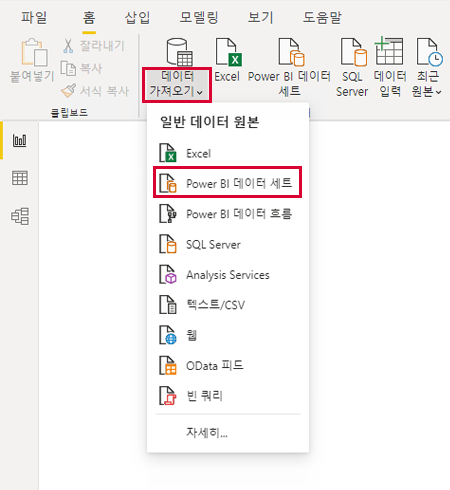

	*이제 4개의 보고서 페이지를 만들고 각 페이지에서 다른 시각적 개체로 작업하여 데이터를 분석하고 탐색합니다.*

# 연습 2: 분산 차트 만들기

이 연습에서는 애니메이션화할 수 있는 분산 차트를 만듭니다.

### 작업 1: 애니메이션 분산 차트 만들기

이 작업에서는 애니메이션화할 수 있는 분산 차트를 만듭니다.

1. **페이지 1**의 이름을 **분산 차** **트**로 바꿉니다.

	

2. 보고서 페이지에 **분산형 차트** 시각적 개체를 추가한 다음 위치를 변경하고 크기를 조정하여 전체 페이지를 채웁니다.

	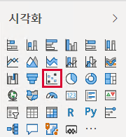

	

3. 시각적 개체 저장소에 다음 필드를 추가합니다.

	* 범례: **재판매인 | 비즈니스 유형**

	* X축: **영업 | 영업** 

	* Y축: **영업 | 이익률**

	* 크기: **영업 | 수량**

	* 재생 축: **날짜 | 분기**

	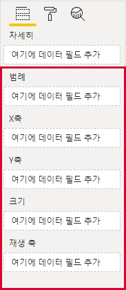

	*필드가 **재생 축** 웰에 추가되면 차트를 애니메이션화할 수 있습니다*.

4. **필터** 창에서 **제품 | 범주** 필드를 **이 페이지의 필터**웰에 추가합니다.

5. 필터 카드에서 **자전거**로 필터링합니다.

	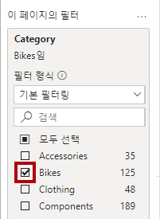

6. 차트를 애니메이션화하려면 왼쪽 하단 모서리에서 **재생**을 클릭합니다.

	

7. **FY2018 Q1**부터 **FY2020 Q4**까지의 전체 애니메이션 주기를 시청합니다.

	*분산 차트를 사용하면 측정값을 동시에 이해할 수 있습니다(이 경우 주문 수량, 판매 수익 및 이익률)*.

	*각 거품은 재판매인 비즈니스 유형을 나타냅니다. 거품 크기의 변화는 주문 수량이 증가하거나 감소하는 것을 반영합니다. 수평 이동은 매출의 증가/감소를 나타내며 수직 이동은 수익성 증가/감소를 나타냅니다*.

8. 애니메이션이 중지되면 거품 중 하나를 클릭하여 시간 경과에 따른 추적을 표시합니다.

9. 거품 위를 마우스로 가리켜서 해당 시점에 재판매인 유형에 대한 측정값을 설명하는 도구 설명을 표시합니다.

10. **필터** 창에서 **의류**로만 필터링하면 매우 다른 결과가 생성됩니다.

11. Power BI Desktop 파일을 저장합니다.

# 연습 3: 예측 만들기

이 연습에서는 향후 판매 수익을 결정할 예측을 만듭니다.

### 작업 1: 예측 만들기

이 작업에서는 향후 판매 수익을 결정할 예측을 만듭니다.

1. 새 페이지를 추가한 다음 페이지의 이름을 **예측**으로 바꿉니다.

	

2. 보고서 페이지에 **꺾은선형 차트** 시각적 개체를 추가한 다음 위치를 조정하고 크기를 조정하여 전체 페이지를 채웁니다.

	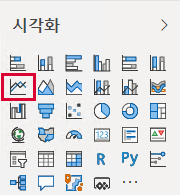

	

3. 시각적 개체 저장소에 다음 필드를 추가합니다.

	* 축: **날짜 | 날짜**

	* 값: **판매 | 판매** 

	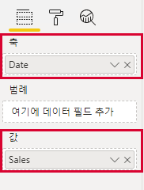

4. **필터** 창에서 **날짜** 추가 ** | 연도** 필드를 **이 페이지의 필터**로 추가합니다.

5. 필터 카드에서 2년으로 필터링합니다. **FY2019** 및 **FY2020**.

	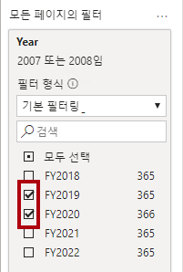

	*타임라인을 통해 예측할 때 정확하고 안정적인 예측을 생성하려면 최소 2회 주기(연도)의 데이터가 필요합니다*.

6. **제품 추가 | 범주** 필드도  **이 페이지의 필터** 웰에 추가하고, **자전거**로 필터링합니다.

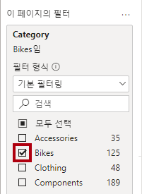

7. 예측을 추가하려면 **시각화** 창 아래 **분석** 창을 선택합니다.

	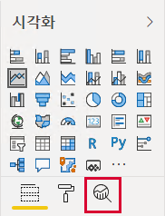

8. **예측** 섹션을 확장합니다.

	

	***예측** 섹션을 사용할 수 없는 경우 시각적 개체가 올바르게 구성되지 않았기 때문일 수 있습니다. 예측은 축에 날짜 유형의 단일 필드가 있고, 여기에 하나의 값 필드만 있어야 한다는 두 조건이 충족될 때만 사용할 수 있습니다.*

9. **추가**를 클릭합니다.

	

10. 다음 예측 속성을 구성합니다.

	* 예측 길이: 1개월

	* 신뢰 구간: 80%

	* 계절성: 365

11. **적용**을 클릭합니다.

	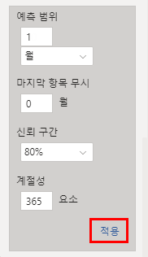

12. 선 시각적 개체에서 예측이 기록 데이터를 한 달 이상 연장한 것을 알 수 있습니다.

	*회색 영역은 신뢰도를 나타냅니다. 신뢰도가 넓어질수록, 안정적이지 않기 때문에 예측 정확도는 떨어지게 됩니다*.

	*주기의 길이를 알고 있는 경우(이 경우 연간), 계절성 포인트를 입력해야 합니다. 때로는 주 단위(7) 또는 월 단위(30)일 수 있습니다*.

13. **필터** 창에서 **의류**로만 필터링하면 다른 결과가 생성됩니다.

14. Power BI Desktop 파일을 저장합니다.

# 연습 4: 분해 트리로 작업

이 연습에서는 분해 트리를 만들어 재판매인의 지리 및 이윤 간의 관계를 탐색합니다.

### 작업 1: 분해 트리로 작업

이 작업에서는 분해 트리를 만들어 재판매인의 지리 및 이익률 간의 관계를 탐색합니다.

1. 새 페이지를 추가한 다음 페이지 이름을 **분해 트리**로 바꿉니다.

	

2. **삽입** 리본의 **AI 시각적 개체** 그룹 내부에서 **분해 트리**를 클릭합니다.

	*팁: AI 시각적 개체는 **시각화** 창에서도 사용할 수 있습니다*.

	

3. 전체 페이지를 채울 수 있도록 시각적 개체의 위치를 재배치하고 크기를 조정합니다.

	

4. 시각적 개체 저장소에 다음 필드를 추가합니다.

	* 분석: **영업 | 이익률**

	* 설명: **Reseller | 지리** (전체 계층 구조)

	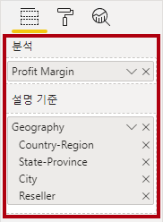

5. **필터** 창에서 **날짜 | 연도** 필드를  **이 페이지의** **필터** 웰에 추가하고 필터를 **FY2020**으로 설정합니다.

	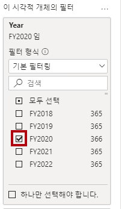

6. 분해 트리 시각적 개체에서 트리의 루트를 확인합니다. **이익률** -0.94%

	

7. 플러스 아이콘을 클릭하고 컨텍스트 메뉴에서 **높은 값**을 선택합니다.

	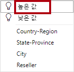

8. 의사 결정 트리는 가장 높은 이윤으로 주문한 재판매인을 제시합니다.

9. 해당 수준을 제거하려면 시각적 개체 상단에서 **재판매인** 레이블 옆에 있는 **X**를 클릭합니다.

	

10. 플러스 아이콘을 다시 클릭한 다음 **국가-지역** 수준으로 확장합니다.

11. **미국**에서 **시-도** 수준으로 확장합니다.

12. **주-도**의 시각적 개체 하단에 있는 아래쪽 화살표를 사용한 다음 수익성이 낮은 상태로 스크롤합니다.

13. **뉴욕** 주는 수익성이 마이너스임을 알 수 있습니다.

14. **뉴욕**에서 **재판매인** 수준으로 확장합니다.

15. 근본 원인을 쉽게 분리할 수 있습니다.

	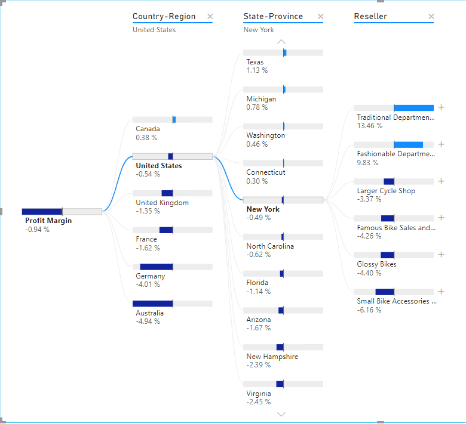

	***미국**은 **FY2020**에 수익을 내지 못하고 있습니다. **뉴욕**은 긍정적인 이익을 달성하지 않는 주이며, 이는 네 재판매인이 상품에 대한 표준 비용보다 적은 금액을 지불하기 때문입니다.*

16. Power BI Desktop 파일을 저장합니다.

# 연습 5: 주요 영향 요인을 사용하여 작업

이 연습에서는 주요 영향 요인인 AI 시각적 개체를 사용하여 재판매인의 비즈니스 유형 및 지리 내에서 수익성에 어떤 영향을 미치는지 확인합니다.

### 작업 1: 주요 영향 요인으로 작업

이 작업에서는 주요 영향 요인인 AI 시각적 개체를 사용하여 재판매인의 비즈니스 유형 및 지리 내에서 수익성에 어떤 영향을 미치는지 확인합니다.

1. 새 페이지를 추가한 다음 페이지의 이름을 **주요 영향 요인**으로 바꿉니다.

	

2. **삽입** 리본의 **AI 시각적 개체** 그룹 내부에서 **주요 영향 요인**을 클릭합니다.

	*팁: AI 시각적 개체는 **시각화** 창에서도 사용할 수 있습니다*.

	

3. 전체 페이지를 채울 수 있도록 시각적 개체의 위치를 재배치하고 크기를 조정합니다.

	

4. 시각적 개체 웰에 다음 필드를 추가합니다.

	* 분석: **판매 | 이익률**

	* 설명: **재판매인 | 비즈니스 유형** 및 **재판매인 | 지리** (전체 계층 구조)

	* 확장 기준: **판매 | 수량**

	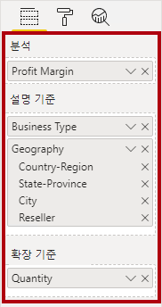

5. 시각적 개체의 왼쪽 상단에는 **핵심 영향 요소**에 초점을 맞추고 있으며 특정 영향 요소는 증가할 이익의 마진을 포함하는 것을 이해하도록 설정되어 있습니다.

	

6. 결과를 검토하면 **Bothel** 도시가 증가할 가능성이 더 높습니다.

7. 대상을 수정하여 이윤이 감소하는 데 영향을 미치는 것이 무잇인지 확인합니다.

	

8. 결과 검토.

9. 세그먼트를 감지하려면 왼쪽 상단에서 **상위 세그먼트**를 선택합니다.

	

10. 이제 이윤이 높을 가능성이 있는 세그먼트를 결정하는 것이 목표입니다.

11. 시각적 개체가 세그먼트(원)를 표시하면 세그먼트 중 하나를 클릭하여 세그먼트에 대한 정보를 표시합니다.

12. 세그먼트 결과 검토.

### 완료

이 작업에서는 랩을 완료합니다.

1. Power BI Desktop 파일을 저장합니다.

2. **분산 차트** 페이지를 선택합니다.

3. 파일을 **판매 분석** 작업 영역에 게시합니다.

4. Power BI Desktop을 닫습니다.
