

### 랩 12A

Power BI 콘텐츠 게시 및 공유

# 개요

**랩을 완료하는 데 예상되는 시간은 45분입니다.**

이 랩에서는 교실 파트너와 짝을 이뤄 협력하여 Power BI 콘텐츠를 공유하기 위한 세 가지 핵심 방법을 알아봅니다.

이 랩에서는 다음의 작업을 수행하는 방법에 대해 배웁니다.

* 데이터 세트 역할에 보안 주체 매핑

* 대시보드 공유

* 앱 게시

# 연습 1: 데이터 세트 보안 구성

이 연습에서는 데이터 세트의 **영업 직원** 역할에 교실 파트너의 계정을 할당합니다.

### 작업 1: 데이터 세트 보안 구성

이 작업에서는 데이터 세트의 **영업 직원** 역할에 교실 파트너의 계정을 할당합니다.

1. Edge에서 Power BI 서비스의 **탐색** 창에서 **판매 분석** 데이터 세트 위로 커서를 올리고 세로 줄임표(…)를 클릭한 다음 **보안**을 선택합니다.

	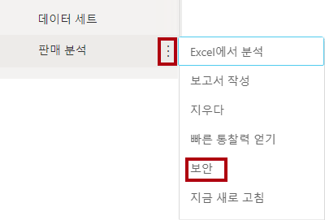

2. **행 수준 보안** 페이지의 왼쪽에서 **Salespeople** 역할이 선택됨을 알 수 있습니다.

3. **구성원** 상자에서 교실 파트너의 계정 이름 입력을 시작하고 계정 이름이 목록에 추가되었을 때 선택합니다.

	*개별 계정을 추가하는 것은 시간이 많이 걸리며 많은 유지 관리가 필요합니다. Adventure Works 회사는 모든 영업 직원 계정이 포함된 보안 그룹을 가지고 있을 가능성이 높다는 것을 고려합니다. 이 보안 그룹은 역할에 매핑된 유일한 보안 주체입니다.*

4. **추가**를 클릭합니다.

	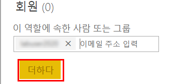

5. 페이지 하단의 **저장**을 클릭합니다.

	

	*이제 교실 파트너의 계정이 **영업 직원** 역할에 매핑됩니다. 그들의 계정은 두 판매 지역의 판매량으로 판매 실적이 평가되는 영업 직원 Pamela Ansam-Wolfe를 위한 것이라는 것을 기억하세요. 미국 북서부와 미국 남서부*.

# 연습 2: 대시보드 공유

이 연습에서는 **영업 모니터링** 대시보드를 교실 파트너와 공유합니다(그리고 교실 파트너는 당신과 공유합니다).

### 작업 1: 대시보드 공유

이 작업에서는 각각 대시보드를 공유한 다음 공유된 공유 대시보드를 엽니다.

*교실 파트너와 함께 각 컴퓨터에서 모든 작업 단계를 함께 작업할 수 있습니다*.

1. **영업 모니터링** 대시보드를 엽니다.

7. 메뉴 모음에서 **공유**를 클릭합니다.

	

8. **공유 대시보드** 창(오른쪽에 위치)의 **액세스 권한 부여 대상** 상자에서 교실 파트너의 계정 이름 입력을 시작합니다. 계정 이름이 목록에 나열되면 선택합니다.

9. 사용 가능한 옵션을 검토하지만 변경하지는 않습니다.

10. 창의 하단에서 **공유**를 클릭합니다.

	

### 작업 2: 공유 대시보드 열기

이 작업에서는 각각 사용자와 공유된 대시보드를 엽니다.

1. **탐색** 창에서 **공유한 항목**을 클릭합니다.

	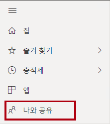

12. **영업 모니터링** 대시보드가 나열되어 있습니다.

	

13. 대시보드를 열려면 **영업 모니터링** 대시보드를 클릭합니다.

14. 대시보드 **판매 YTD** 타일 값은 **1300만 달러**입니다.

	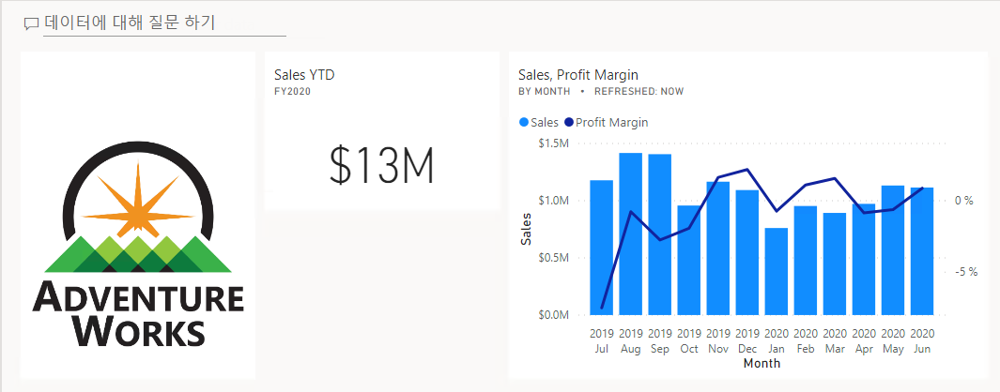

	* **영업 YTD** 타일은 미국 북서부 및 미국 남서부 지역의 값만 표시합니다*.

	*대시보드 (및 보고서) 공유는 콘텐츠 소유자가 쉽게 달성하고 관리할 수 있습니다. Power BI는 수신자에게 읽기 전용 환경을 제공합니다. 소유자가 다시 공유할 수 있도록 하는 경우 수신자는 다른 사용자와 콘텐츠를 공유할 수 있습니다*.

	*이 방법은 애드혹 공유 요구 사항을 위해 예약해야 합니다. 많은 Power BI 항목을 공유해야 하는 경우 앱을 게시하는 것이 더 좋은 옵션입니다. 다음 연습에서는 영업 분석 작업 영역을 앱으로 게시합니다*.

# 연습 3: 앱 게시

이 연습에서는 **영업 분석** 작업 영역의 콘텐츠를 게시한 다음 교실 파트너가 게시한 앱을 "가져옵니다".

### 작업 1: 앱 게시

이 작업에서는 **영업 분석** 작업 영역의 콘텐츠를 게시한 다음 교실 파트너가 게시한 앱을 "가져옵니다".

1. **탐색** 창에서 **판매 분석** 작업 영역을 엽니다.

16. **탐색** 창에서 작업 영역의 이름을 클릭합니다.

	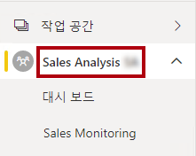

17. 오른쪽 상단에서 **앱 게시**를 클릭합니다.

	

18. 앱 게시하기 프로세스에는 다음 세 가지 탭의 구성이 필요합니다. **설정**, **탐색** 및 **사용 권한**.

	

19. **설명** 상자에 다음을 입력합니다. **판매 분석 및 탐색**

	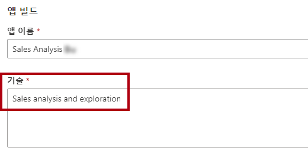

20. **앱 로고**의 경우 **업로드**를 클릭합니다.

	그림 91](Linked_image_Files/PowerBI_Lab12A_image13.png)

21. **열기** 창에서 **D:\DA100\Lab12A\Assets\Icons** 폴더로 이동합니다.

22. JPG 파일 중 하나를 선택한 다음, **열기**를 클릭합니다.

23. **앱 테마 색**에서 아무 색이나 선택합니다.

24. **탐색** 탭을 선택합니다.

	

25. **탐색** 섹션에서, 게시할 작업 영역 콘텐츠를 확인합니다.

	*작업 영역 콘텐츠의 순서를 설정할 수 있으며, 섹션과 링크를 추가할 수도 있습니다. 섹션은 단일 수준의 콘텐츠 그룹화입니다(폴더와 유사합니다). 링크는 유효한 웹 페이지에 대한 링크입니다. 이 랩에서는 탐색 설정을 수정하지 않습니다*.

26. **사용 권한** 탭을 선택합니다.

	

27. **특정 개인 또는 그룹** 상자에서 클래스룸 파트너의 계정 이름 입력을 시작하고 계정 이름이 목록에 나타나면 선택합니다.

	*테넌트 관리자가 제한한 경우 **전체 조직** 옵션을 사용할 수 없을 수도 있습니다. 이 경우 **이 앱 자동 설치** 옵션 또한 사용할 수 없습니다. 이 옵션이 활성화되면, 앱을 모든 사용자에게 푸시할 수 있습니다. 다음 작업에서는 앱을 "가져오기"하는 방법을 배웁니다*.

28. 오른쪽 하단 모서리에 있는 **앱 게시**를 클릭합니다.

	

29. 앱을 게시하라는 메시지가 표시되면, **게시하기**를 클릭합니다.

	

30. 앱이 성공적으로 게시되었다는 알림을 받으면, **닫기**를 클릭합니다.

	

### 작업 2: 앱 가져오기

이 작업에서는 앱 "가져오기"를 수행하고 앱 콘텐츠를 탐색합니다.

1. **탐색** 창에서 **앱**을 클릭합니다.

	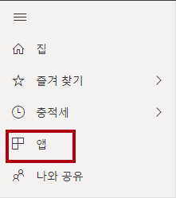

32. 페이지 중간에서 **앱 가져오기**를 클릭합니다.

	

33. 교실 파트너가 게시한 **영업 분석** 앱의 경우 AppSource 창에서 **지금 가져오기** 링크를 클릭합니다.

	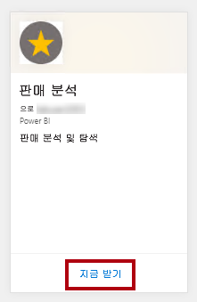

34. 앱이 추가된 후 앱을 열려면, 앱 타일을 클릭합니다.

	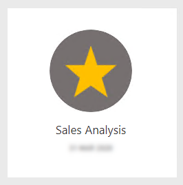

35. 앱이 열리면, (왼쪽의) 탐색 창을 검토합니다.

36. 탐색 창의 첫 번째 항목은 열려 있습니다.

37. 탐색 창에서 **영업 보고서**를 확장한 다음 **개요** 페이지를 선택합니다.

 	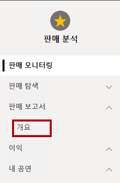

38. **지역** 슬라이서는 Pamela Ansam-Wolfe에 할당된 두 지역만 표시합니다.

	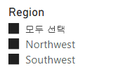

39. **내 실적** 페이지를 선택합니다.

40. 페이지에 Pamela Ansam-Wolfe의 판매 실적과 목표가 표시됩니다.

41. **영업 탐색** 보고서를 열고 각 페이지의 시각적 개체와 상호 작용합니다.
